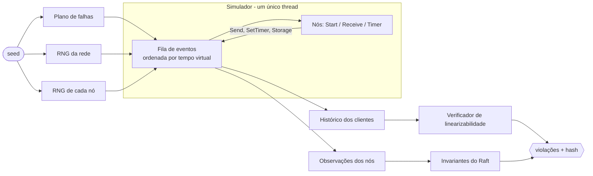

# simulacra

**Testes por simulação determinística para sistemas distribuídos.**

O simulacra roda um sistema distribuído inteiro dentro de um único thread, num mundo onde a rede, o
relógio, a ordem dos eventos, os crashes e as partições saem todos de **uma seed**. Ele executa
centenas de cenários hostis por segundo, verifica propriedades de correção em cada um e, quando algo
quebra, entrega a seed: a falha se reproduz bit a bit, quantas vezes você quiser.

É a mesma técnica usada no FoundationDB, no TigerBeetle e pela Antithesis, aqui implementada do zero
em Go, com uma interface web para investigar cada falha.

```
> simulacra run -bugs stale-read -seeds 500

raftkv  bugs=[stale-read]  500 seeds a partir de 1  (12 workers)
  seed 5        FALHOU  histórico da chave "x" não é linearizável: nenhuma ordem sequencial explica as respostas
  seed 33       FALHOU  histórico da chave "x" não é linearizável: ...
  ...
500 seeds em 1.0s (489 seeds/s) — 40 falharam
```

## Sumário

- [Por que isso existe](#por-que-isso-existe)
- [O que ele encontra](#o-que-ele-encontra)
- [Como rodar](#como-rodar)
- [A interface](#a-interface)
- [Como funciona](#como-funciona)
- [Linha de comando](#linha-de-comando)
- [API HTTP](#api-http)
- [Testar o seu próprio sistema](#testar-o-seu-próprio-sistema)
- [Testes](#testes)
- [Estrutura do projeto](#estrutura-do-projeto)
- [Limites e próximos passos](#limites-e-próximos-passos)

## Por que isso existe

Os piores bugs de sistemas distribuídos dependem de uma coincidência: um nó cai *logo depois* de
votar, uma mensagem atrasada chega *depois* de uma eleição, uma partição isola o líder *enquanto*
um cliente lê. Teste de integração não controla nada disso, então esses bugs passam, aparecem em
produção uma vez por mês e não se reproduzem.

Simulação determinística inverte o jogo:

| Teste de integração | simulacra |
|---|---|
| Relógio e rede reais: cada execução é diferente | Tudo derivado da seed: a execução é uma função pura |
| Uma execução leva segundos | ~5 ms por execução de 8 s virtuais |
| Falha intermitente, "não reproduz na minha máquina" | Falha = seed. Reproduz sempre, em qualquer máquina |
| Falhas injetadas à mão, poucas combinações | Crashes, partições, perdas e duplicações sorteados por seed |

## O que ele encontra

O sistema-alvo incluído é o **Raft KV**: um armazenamento chave-valor replicado com Raft (eleição,
replicação de log, persistência com fsync, sessões de cliente para exatamente-uma-vez), escrito
para este projeto. Ele tem cinco bugs que podem ser ligados um a um, cada um reproduzindo uma
classe de defeito que já apareceu em sistemas de consenso reais.

Números medidos nesta máquina (12 threads), cenário padrão salvo indicação:

| Bug | O que quebra | Propriedade violada | Primeira seed que falha |
|---|---|---|---|
| `stale-read` | Líder responde leituras do estado local, sem confirmar que ainda é líder | Linearizabilidade | 5 |
| `no-dedup` | Retentativas e duplicatas da rede são aplicadas duas vezes | Linearizabilidade | 13 |
| `accept-stale-term` | Seguidor aceita `AppendEntries` de um líder deposto | Segurança da máquina de estados | 4 |
| `unsynced-log` | Seguidor confirma ao líder antes do fsync | Segurança da máquina de estados | 11 |
| `vote-not-persisted` | `votedFor` não vai para o disco | Segurança de eleição | 10.632 (cenário hostil) |

E o controle: **a implementação correta passou em mais de 8.000 seeds** sob o cenário mais
agressivo (10% de perda, 10% de duplicação, crashes e partições a cada ~1 s), sem nenhuma violação.

O `vote-not-persisted` é o caso que justifica a ferramenta. Ele só se manifesta quando duas
candidaturas coincidem no mesmo termo *e* o eleitor reinicia rápido entre uma e outra: cerca de
**1 execução em 5.000**. Um teste de integração praticamente nunca veria isso. Aqui são ~30
segundos de campanha:

```
> simulacra run -bugs vote-not-persisted -crash 1.5 -partition 1.5 -seeds 20000
  seed 10632    FALHOU  dois líderes no termo 1: S0 e S1
  seed 11212    FALHOU  dois líderes no termo 16: S0 e S1
  ...
20000 seeds em 29.3s (683 seeds/s) — 4 falharam
```

Esse bug também mostrou uma lacuna do próprio simulador durante o desenvolvimento: ele só apareceu
depois que o gerador de falhas ganhou **partições em ponte** (A e B não se enxergam, mas ambos
falam com C) e **reinícios rápidos**. Vale o registro: um simulador só encontra o que o seu gerador
de falhas consegue produzir.

## Como rodar

Pré-requisitos: **Go 1.26+** e **Node 22+**. Nada mais: sem banco, sem Docker.

```powershell
.\run.ps1
```

ou, pelo Explorer ou `cmd`, dê dois cliques em `run.bat`.

O script instala as dependências do frontend, compila a interface, embute-a no binário Go, sobe o
servidor em `http://127.0.0.1:7777` e abre o navegador.

| Comando | O que faz |
|---|---|
| `.\run.ps1` | Compila tudo e roda (um binário só, frontend embutido) |
| `.\run.ps1 -Dev` | Backend + Vite com hot reload em `http://localhost:5173` |
| `.\run.ps1 -Test` | `go vet`, todos os testes do Go e a checagem de tipos do frontend |
| `.\run.ps1 -Port 8080 -NoBrowser` | Outra porta, sem abrir o navegador |

Em Linux/macOS:

```bash
(cd web && npm install && npm run build) && go run ./cmd/simulacra serve
```

### Roteiro de 2 minutos

1. Clique em **Rodar 1.000 seeds** sem marcar nenhum bug. Tudo verde: o Raft correto sobrevive.
2. Volte, marque **Leitura sem confirmar liderança** e rode de novo. Aparecem quadrados vermelhos.
3. Clique num vermelho. Você está no replay: o selo confirma que o hash da re-simulação é idêntico
   ao da campanha.
4. Abra **Histórico dos clientes**: a operação em vermelho é a leitura que devolveu um valor velho.
5. Clique em **Minimizar falhas**: o simulador descobre quais falhas injetadas eram realmente
   necessárias para o bug aparecer.

## A interface

**Campanhas.** Formulário com cenários prontos, seleção de bugs e controles de hostilidade (perda,
duplicação, latência, crashes e partições por segundo). O progresso chega ao vivo por SSE.

**Mapa de seeds.** Um quadrado por seed, desenhado em canvas (aguenta 100 mil). Verde passou,
vermelho violou uma propriedade.

**Replay.** A tela principal, para uma seed:

- **Diagrama espaço-tempo.** Uma raia por nó, o tempo corre para a direita, cada mensagem é uma
  seta do envio à entrega (tracejada com ✕ se foi perdida). Crashes são faixas hachuradas,
  partições são bandas âmbar, losangos marcam quem virou líder e em qual termo, e uma linha vermelha
  marca a violação. Zoom com a roda do mouse, arraste para navegar, clique numa mensagem para ver
  o conteúdo.
- **Histórico dos clientes.** Cada operação como um intervalo (chamada → resposta). Quando a
  linearizabilidade falha, mostra a maior ordem sequencial que o verificador conseguiu montar
  (numerada) e a operação que não cabe em lugar nenhum.
- **Eventos.** Todos os eventos da execução, com filtro e busca, numa lista virtualizada.
- **Falhas injetadas.** Cada crash e partição com uma caixa de seleção: desmarque e a seed é
  re-simulada sem aquela falha. É um "e se?" interativo.

Nada disso é gravado em disco. A campanha guarda só o resumo de cada seed; o trace completo é
recalculado na hora, porque a seed *é* a gravação.

## Como funciona



### Determinismo

O sistema sob teste não cria goroutines, não lê o relógio e não abre sockets. Ele é um conjunto de
atores que implementam três métodos e só falam com o mundo por um `Env`:

```go
type Node interface {
    Start(env *Env)                          // boot e cada reinício
    Receive(env *Env, from NodeID, msg any)
    Timer(env *Env, tag any)
}
```

O simulador é um laço de eventos discretos: tira da fila o evento de menor tempo virtual, avança o
relógio e chama o ator. Empates são resolvidos por número de sequência. Como só existe um thread e
toda aleatoriedade vem de geradores PCG semeados, a execução é uma função pura da seed.

Rede, plano de falhas e cada nó sorteiam de **fluxos independentes**. Isso importa na minimização:
desligar uma falha não desloca os sorteios do resto da execução.

Cada execução produz um **hash** (FNV-64 sobre tempo, tipo, origem e destino de cada evento, mais as
respostas dos clientes). A campanha guarda o hash; o replay recalcula e compara. Se um dia o código
do sistema-alvo ganhar uma fonte de não determinismo (iterar um `map`, por exemplo), o selo acusa.

### O mundo simulado

| Componente | Comportamento |
|---|---|
| **Rede** | Latência uniforme configurável, perda, duplicação e "mensagens lentas" (10× a latência, o que gera reordenação) |
| **Disco** | `Put` vai para um page cache; só `Sync` torna a escrita durável. Um crash descarta o que não foi sincronizado |
| **Crashes** | O processo some, timers morrem, o disco fica. Metade são reinícios rápidos (10–150 ms), metade quedas longas (até 2 s). No máximo uma minoria fora do ar ao mesmo tempo |
| **Partições** | Três formas: bipartição, isolamento de um nó e ponte (dois lados que não se falam, com um nó no meio que alcança ambos) |
| **Período quieto** | Falhas só começam nos primeiros 70% da execução e todas se curam até 85%, deixando um final estável |

### Verificação

Três propriedades são checadas ao fim de cada execução:

- **Linearizabilidade** do histórico dos clientes: existe uma ordem sequencial das operações,
  compatível com o tempo real, que explique todas as respostas? O verificador implementa a busca de
  Wing & Gong com a memoização de Lowe (a abordagem do Knossos e do Porcupine), particionando o
  histórico por chave. Operações sem resposta são tratadas como "podem ter ocorrido em qualquer
  momento depois da chamada". Há um teto de 2 milhões de estados por chave; estourado o teto, o
  resultado é "desconhecido", nunca um falso positivo.
- **Segurança de eleição**: no máximo um líder por termo.
- **Segurança da máquina de estados**: dois nós nunca aplicam entradas diferentes no mesmo índice
  (inclui um nó que reinicia e reaplica um log diferente do que tinha).

### Minimização

Dada uma seed que falha, o simulador desliga as falhas injetadas uma a uma e mantém o desligamento
sempre que o mesmo tipo de violação continua acontecendo (delta debugging guloso, duas passadas).
O resultado é o menor conjunto de crashes e partições que ainda reproduz o bug, geralmente uma ou
duas falhas em vez de cinco ou dez.

## Linha de comando

```
simulacra serve   [-addr 127.0.0.1:7777] [-data ./data]
simulacra run     [cenário] [-seeds 500] [-start 1] [-workers N]
simulacra replay  [cenário] -seed N [-out trace.json]
simulacra shrink  [cenário] -seed N
simulacra systems

cenário:
  -system raftkv -bugs stale-read,no-dedup -servers 3 -clients 3 -duration 8000
  -drop 0.02 -dup 0.01 -crash 0.6 -partition 0.5
```

`run` sai com código 3 se alguma seed falhar, então serve direto num pipeline de CI.

```
> simulacra shrink -bugs stale-read -seed 5
seed 5 (linearizability): 5 → 3 falhas em 9 execuções; mantidas [0 1 3]
```

## API HTTP

| Método | Rota | Descrição |
|---|---|---|
| `GET` | `/api/systems` | Sistemas disponíveis e o catálogo de bugs |
| `GET` | `/api/defaults` | Cenário padrão |
| `GET` | `/api/campaigns` | Lista de campanhas |
| `POST` | `/api/campaigns` | Cria e inicia uma campanha: `{config, seeds, startSeed}` |
| `GET` | `/api/campaigns/{id}` | Campanha com o resultado de cada seed |
| `GET` | `/api/campaigns/{id}/stream` | Progresso por Server-Sent Events |
| `POST` | `/api/campaigns/{id}/cancel` | Interrompe |
| `DELETE` | `/api/campaigns/{id}` | Apaga |
| `GET` | `/api/campaigns/{id}/seeds/{seed}?disabled=1,3` | Re-simula com trace completo |
| `POST` | `/api/campaigns/{id}/seeds/{seed}/shrink` | Minimiza as falhas |

O servidor escuta só em `127.0.0.1`, valida todos os intervalos do cenário, limita o corpo das
requisições, rejeita escritas vindas de outra origem e envia cabeçalhos de segurança (CSP,
`X-Frame-Options`, `nosniff`).

## Testar o seu próprio sistema

1. Escreva seus nós como atores que implementam `sim.Node` e usam só o `Env` (`Send`, `SetTimer`,
   `Storage`, `Rand`, `Now`). Não itere `map` em nada que afete mensagens ou estado.
2. Escreva um cliente (também um `sim.Node`) que chame `env.Invoke` ao começar uma operação e
   `env.Complete` ao receber a resposta. Isso constrói o histórico.
3. Reporte fatos com `env.Observe("leader", ...)` para os verificadores de invariantes.
4. Registre o sistema em `internal/harness/harness.go` com uma função `Build` e uma `Check`.

O `internal/systems/raftkv` é o exemplo completo, com ~800 linhas.

## Testes

```powershell
.\run.ps1 -Test
```

| Pacote | O que cobre |
|---|---|
| `internal/sim` | Partições bloqueiam e curam, ponte mantém o nó do meio conectado, crash perde escritas sem fsync, mesma seed gera o mesmo trace, o plano de falhas respeita a minoria e o período quieto |
| `internal/check` | Dez históricos conhecidos (linearizáveis e não), operações pendentes, independência entre chaves, e que o relatório aponta a chave e a operação certas |
| `internal/harness` | Determinismo entre execuções com e sem gravação, Raft correto sobrevive a 150 seeds, **cada um dos cinco bugs é encontrado**, e a minimização preserva a falha |
| `internal/server` | Ciclo completo pela API: criar, acompanhar o SSE, replay com hash idêntico, minimizar, apagar; validação de entrada; rejeição de escrita entre origens; fallback da SPA |

O teste do `vote-not-persisted` varre até 30 mil seeds em paralelo e é pulado com `-short`. O CI roda
os testes também com o detector de corridas (`-race`).

## Estrutura do projeto

```
cmd/simulacra/            CLI: serve, run, replay, shrink, systems
internal/
  sim/                    o simulador: fila de eventos, rede, disco, crashes, plano de falhas, trace
  check/                  verificador de linearizabilidade (Wing & Gong + memoização)
  systems/raftkv/         Raft KV: servidor, cliente, catálogo de bugs, invariantes
  harness/                cenário → simulação → verificação; minimização
  campaign/               campanhas em paralelo, persistência em JSON
  server/                 API HTTP, SSE, frontend embutido
web/                      React 19 + TypeScript + Vite + Tailwind v4 + TanStack Query
  src/components/         SpaceTime, HistoryView, Overview, EventTable, SeedGrid, CampaignForm
  src/pages/              Home, Campaign, Run
run.ps1 / run.bat         compila e roda
```

**Backend:** Go 1.26, só biblioteca padrão (zero dependências externas).
**Frontend:** React 19, TypeScript 7, Vite 8, Tailwind CSS 4, TanStack Query 5, React Router 8;
gráficos em SVG e canvas feitos à mão, sem biblioteca de charts.

## Limites e próximos passos

O que o projeto **não** faz hoje, dito com clareza:

- **Não testa binários arbitrários.** O sistema-alvo precisa ser escrito no modelo de atores do
  `Env`. Interceptar goroutines, relógio e rede de um programa Go qualquer exigiria um runtime
  modificado ou um hipervisor determinístico, que é o que a Antithesis vende.
- **O Raft testado é o deste repositório**, com bugs injetados de propósito. Os bugs são realistas,
  mas ainda não há um bug encontrado em projeto de terceiros.
- **Não verifica vivacidade** (o sistema volta a progredir depois das falhas?), só segurança.
- **A minimização só remove falhas**; não encurta a execução nem reduz o número de operações.

Próximos passos, em ordem:

1. Adaptar uma biblioteca Raft de terceiros (`hashicorp/raft` ou `etcd/raft`, que já é uma máquina
   de estados pura) ao `Env` e rodar campanhas contra ela.
2. Verificação de vivacidade no período quieto.
3. Falhas de disco: fsync que mente, escrita rasgada, corrupção de bloco.
4. Relógios com desvio por nó, para testar leases.
5. Minimização do histórico (menos clientes, menos operações, execução mais curta).

## Licença

MIT. Veja [LICENSE](LICENSE).
